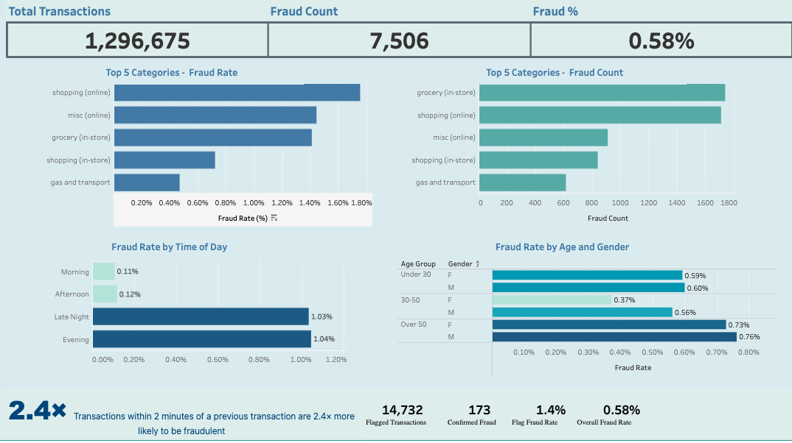

# Fraud Analytics ELT Pipeline

An end-to-end ELT pipeline built with Python, dbt, Snowflake, SQL, and Tableau to answer a single business question:

> **Where, when, and to whom does credit card fraud occur — and what transaction behaviors predict it?**

[View the Tableau Dashboard →](https://public.tableau.com/app/profile/romtin.kharrazi/viz/FraudDashboard_17809805593950/Dashboard1)



---

## Key Findings

| Finding | Detail |
|---|---|
| Online shopping has the highest fraud rate | 1.80% fraud rate — 3x the dataset average |
| Evening & late night dominate fraud timing | 9x higher fraud rate than morning and afternoon hours |
| Cardholders over 50 are most vulnerable | Males over 50 have a 0.76% fraud rate — highest of any demographic |
| Successive transactions predict fraud | Transactions within 2 minutes of a prior transaction are 2.4x more likely to be fraudulent |

---

## Pipeline Architecture

```
fraudTrain.csv (1,296,675 rows)
        │
        ▼
┌───────────────────┐
│     Raw Layer     │  CSV loaded into Snowflake
│  Snowflake · RAW  │  Raw data remains untouched
└────────┬──────────┘
         │
         ▼
┌───────────────────┐
│   Staging Layer   │  dbt view — stg_transactions - staging table
│ Snowflake · STAGING│  Cleans types, renames columns, strips merchant prefix
└────────┬──────────┘
         │
         ▼
┌───────────────────┐
│    Mart Layer     │  dbt tables — 3 aggregation models
│ Snowflake · MARTS │  fraud_by_category · fraud_by_hour · fraudrisk_by_demographics
└────────┬──────────┘
         │
         ▼
┌───────────────────┐
│     Tableau       │  Published dashboard with KPIs,
│  Public Dashboard │  category, time-of-day, and demographic breakdowns
└───────────────────┘
```

---

## Tech Stack

| Layer | Tool |
|---|---|
| Ingestion | Python · CSV |
| Storage & Compute | Snowflake |
| Transformation | dbt Core |
| Exploratory Analysis | Python · pandas · DuckDB |
| Visualization | Tableau Public |

---

## Project Structure

```
fintech_pipeline/               ← dbt project root
├── models/
│   ├── staging/
│   │   ├── sources.yml         # Defines Snowflake raw source
│   │   ├── schema.yml          # Column-level tests for stg_transactions
│   │   └── stg_transactions.sql
│   └── marts/
│       ├── schema.yml          # Column-level tests for all mart models
│       ├── fraud_by_category.sql
│       ├── fraud_by_hour.sql
│       └── fraudrisk_by_demographics.sql
├── dbt_project.yml
└── README.md
```

---

## dbt Models

### Staging — `stg_transactions` (view)

Reads from `FINTECH_PIPELINE.RAW.RAW`. Casts timestamps and dates to proper types, rounds transaction amounts, strips the `fraud_` prefix from merchant names, filters null primary keys, and enforces unique primary keys. This layer keeps the raw table untouched while producing a clean data table for downstream analysis.

### Marts (tables)

**`fraud_by_category`** — Aggregates fraud rate, fraud count, total transactions, and average fraud amount by merchant category. Used to answer which spending categories carry the highest fraud risk.

**`fraud_by_hour`** — Aggregates transactions into Late Night, Morning, Afternoon, and Evening time windows and computes fraud rate per window. Surfaces the strong evening/late-night fraud concentration.

**`fraudrisk_by_demographics`** — Aggregates fraud victims by age group (Under 30 / 30–50 / Over 50) and gender. Age is derived from `date_of_birth` and `transaction_timestamp` using `DATEDIFF`.

---

## dbt Tests

Schema tests are defined for both the staging and mart layers:

- `unique` and `not_null` on `transaction_id` (primary key)
- `not_null` on `is_fraud`, `amount`, `category`, `transaction_timestamp`
- `accepted_values` on `is_fraud` allows only `[0, 1]` as values
- `not_null` on all mart key columns and metrics

All tests pass against the full 1.29M-row dataset.

---

## Rapid Transaction Fraud Feature

Built in pandas — flags cards with multiple transactions within a 2-minute window, excluding online categories (online transactions can legitimately occur in rapid succession).

| Metric | Value |
|---|---|
| Transactions flagged | 14,732 |
| Confirmed fraud among flagged | 173 |
| Fraud rate — flagged transactions | 1.4% |
| Fraud rate — full dataset | 0.58% |
| **Lift** | **2.4x more likely to be fraudulent** |

---

## Analytical Decisions

**Why raw → staging → mart?**
Mirrors the architecture used in production data warehouses and dbt projects. Raw data stays untouched as a stable point of origin for data. Staging handles renaming, type casting, and value formatting. Marts pre-aggregate for specific business questions.

**Why pre-aggregate in marts instead of querying against the main staging table?**
Pre-aggregating means that downstream analytical tools like Tableau and pandas only have to query small summary tables instead of the entire dataset. This decision enables higher performance and scalability.

**Why strip the `fraud_` prefix from merchant names?**
The raw dataset prefixes every merchant with `fraud_`. Stripped in the staging layer so merchant names are clean and readable in future analysis / dashboards.

**Why exclude online categories from the rapid transactions feature?**
Rapid consecutive online transactions are normal. Filtering to rapid in-store transactions draws questions of physical possibility within 2 minutes: fraud should be suspected.


---

## Dataset

[Credit Card Transactions Fraud Detection Dataset](https://www.kaggle.com/datasets/kartik2112/fraud-detection) — Kaggle

Simulated credit card transactions: 1.29M Rows.

